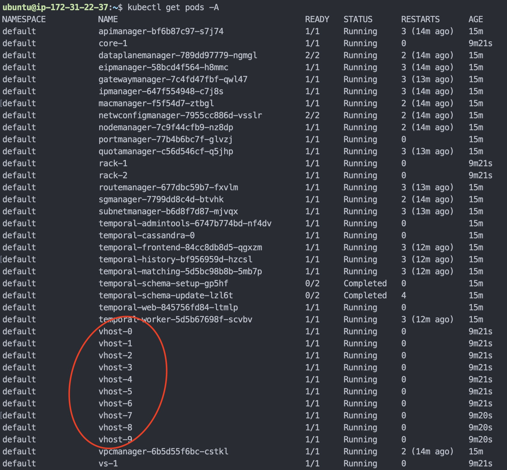
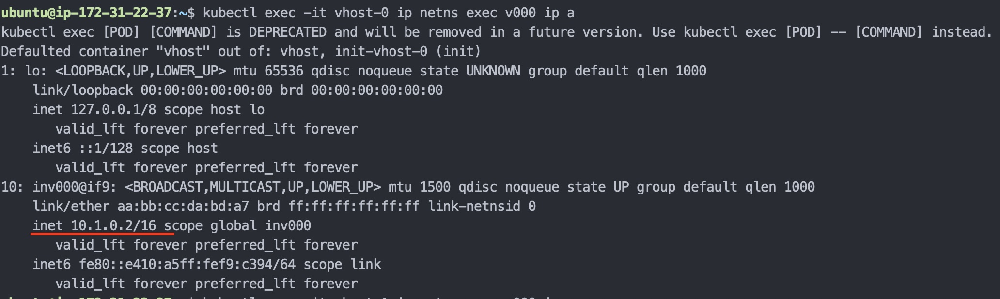
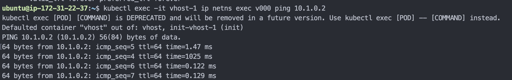
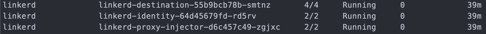

# Merak

A Large-scale Cloud Emulator provides ability to
- emulate data center physical topologies and network devices including hosts, switches, and routers.
- emulate a large volume of compute nodes (more than 100K) with limited physical hardware resources.
- conduct the performance test for a target project's (e.g., Alcor) control plane with a large-size of VPC having more than 1M VMs.
- automatically create and conduct different performance test scenarios and collect results.

## Platforms

There are many different hardware resource management platform in the field, currently we choose two platforms to investigate and create our prototype:

- Kubernetes cluster with Meshnet CNI
- Distrinet with LXD containers

## Architecture

The following diagram illustrate the high-level architecture of Merak on a kubernetes cluster using Meshnet CNI and the basic workflow to emulate Alcor's control plane for creating VMs in the emulated compute nodes.


### Components
- Scenario Manager: create the required topology and test scenarios.
- K8S-Topo: deploy pods with the given topology.
- Merak Network: create network infrastructure resources, e.g., vpcs, subnets, and security groups.
- Merak Compute: register compute nodes informantion, create VMs and collect test results from merak agents.
- Merak Agent: create virtual network devices (bridges, tap devices and veth pairs) and network namespace for VMs, collect test results and send the results back to merak compute.

## Scalability
In order to provide more virtual and emulated resources with limited hardware resources, three possible solutions are investigated and developed in this project:
- Docker-in-Docker
- Kubernetes-in-Kubernetes (KinK)
- Kubernetes cluster in virtual machines

For more detail design and information, please refer to the docs folder in this repository.

## [Kind](https://kind.sigs.k8s.io): Simple Deployment and E2E Test

This test will bring up Merak and [Alcor](https://github.com/futurewei-cloud/alcor) in a
single master node [Kind](https://kind.sigs.k8s.io) Kubernetes cluster.

### Prerequisites

- Minimum Machine Requirements (Our tests were ran on AWS t2.2xlarge ec2 instances)
  - 16GB RAM
  - 8 Core CPU

- Update
```
sudo apt-get update
```
- [Make](https://www.gnu.org/software/make/)
```
sudo apt-get install make
```
- [Helm](https://helm.sh/docs/intro/install/)
```
curl https://raw.githubusercontent.com/helm/helm/main/scripts/get-helm-3 | bash
```
- [Linkerd CLI](https://linkerd.io/2.12/getting-started/)
```
curl --proto '=https' --tlsv1.2 -sSfL https://run.linkerd.io/install | sh
export PATH=$PATH:/home/ubuntu/.linkerd2/bin
```
- [Kind](https://kind.sigs.k8s.io/docs/user/quick-start/#installation)
```
curl -Lo ./kind https://kind.sigs.k8s.io/dl/v0.17.0/kind-linux-amd64 && chmod +x ./kind && sudo mv ./kind /usr/local/bin/kind
```
- [Kubectl](https://kubernetes.io/docs/tasks/tools/install-kubectl-linux/)
```
curl -LO https://dl.k8s.io/release/v1.26.0/bin/linux/amd64/kubectl && sudo install -o root -g root -m 0755 kubectl /usr/local/bin/kubectl
```
- [Docker](https://www.docker.com)
```
sudo apt-get install docker.io
```
  - Add current user to docker group (for running docker without sudo)
```
sudo groupadd docker
sudo gpasswd -a $USER docker
newgrp docker
```

### Step 1: Deploy

You can deploy Merak and [Alcor](https://github.com/futurewei-cloud/alcor) in [Kind](https://kind.sigs.k8s.io) with the command below.

```
git clone https://github.com/futurewei-cloud/merak.git
cd merak
make kind
```

Please wait for all pods to be in running state as shown in the picture below
before proceeding to the next step. This should take approximately 5 minutes.


### Step 2: Run The Test

You can use the prebuilt test tool as shown below.

```
./tools/teste2e/bin/teste2e
```

This will create 10 hosts with 1 VM each.
Once everything is created, you can test network connnectivity as shown below.

1. Run ```kubectl get pods -A``` to see all vhost pods.


1. Merak uses network namespaces to emulate VMs, run ``` kubectl exec -it vhost-0 ip netns exec v000 ip a ``` to get the IP address of the emulated VM `v000` inside of the emulated host `vhost-0`.


1. Ping the VM `v000` on `vhost-0` from a different VM on `vhost-1` with the following command ``` kubectl exec -it vhost-1 ip netns exec v000 ping (IP address from step 2)```


### Clean-up:
Run the command below to clean up the [Kind](https://kind.sigs.k8s.io) environment.
```
kind delete cluster
```

## Getting Started With Development

To build this project, please make sure the following things are installed:

- Go: <https://go.dev/doc/install>
- Protobuf: <https://grpc.io/docs/protoc-installation/>
- Go plugins for gRPC: <https://grpc.io/docs/languages/go/quickstart/>
- Docker: <https://docs.docker.com/engine/install/>

Then, the project can be built with:

```bash
make
```

## How to Deploy a Development Cluster

### Prerequisites

Before deploying Merak with Alcor, you will need the following.

- A Kubernetes cluster with [flannel](https://github.com/flannel-io/flannel) installed
- [Helm](https://helm.sh/docs/intro/install/)
  - ``` curl https://raw.githubusercontent.com/helm/helm/main/scripts/get-helm-3 | bash ```
- Needed for [Alcor](https://github.com/futurewei-cloud/alcor)
  - [Linkerd](https://linkerd.io/2.12/getting-started/) installed on the cluster
  - openvswitch-switch installed on every node (`apt install openvswitch-switch`)


**NOTE: Please wait for all LinkerD pods and containers to be fully running before moving on to the steps below.**



### Deployment
Once your cluster is ready, you can deploy the latest small scale development (one replica for every service) build of Merak and [Alcor](https://github.com/futurewei-cloud/alcor) with the command below.

```
kubectl kustomize https://github.com/futurewei-cloud/merak/deployments/kubernetes/dev --enable-helm | kubectl apply -f -
```

A successful deployment should take roughly 5 minutes for all pods to come to `running` state.
The deployed components are as follows:
- Merak Microservices and their Redis instances
  - Merak Scenario Manager
  - Merak Topology
  - Merak Network
  - Merak Compute
- [Meshnet CNI](https://github.com/networkop/meshnet-cni)
- [Temporal](https://github.com/temporalio/temporal)
- [Prometheus](https://github.com/prometheus/prometheus)
- [Alcor Microservices](https://github.com/futurewei-cloud/alcor) and their [Ignite](https://github.com/apache/ignite) instances
  - Port Manager
  - Network Config Manager
  - API Manager
  - EIP Manager
  - Dataplane Manager
  - IP Manager
  - Mac Manager
  - Node Manager
  - Quota Manager
  - Route Manager
  - Security Group Manager
  - Subnet Manager
  - VPC Manager
- [LinkerD](https://github.com/linkerd/linkerd2)


The deployment settings such as container image and replicas can be changed by editing the kustomize file under `deployments/kubernetes/dev/kustomization.yaml` and redeploying with

```
kubectl kustomize deployments/kubernetes/dev --enable-helm | kubectl apply -f -
```