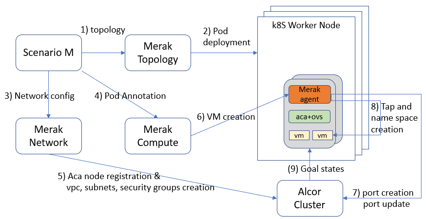
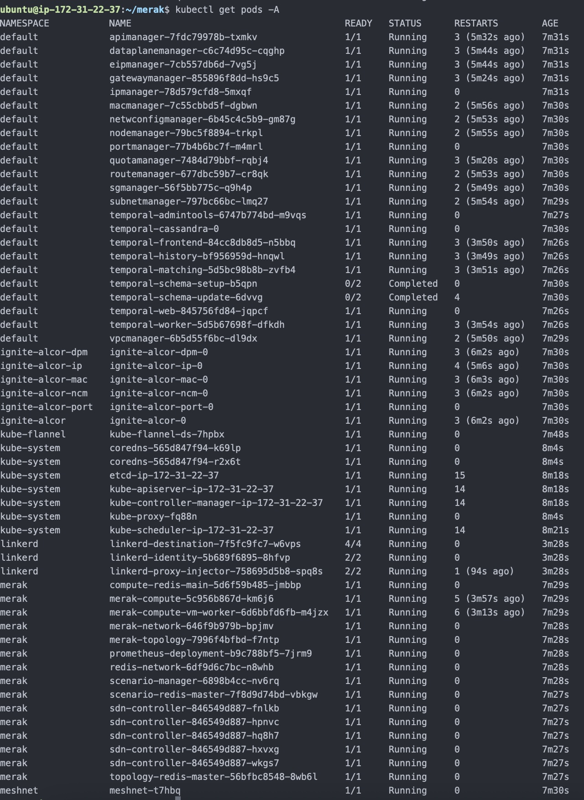

# Merak

A Large-scale Cloud Emulator provides ability to
- emulate data center physical topologies and network devices including hosts, switches, and routers.
- emulate a large volume of compute nodes (more than 100K) with limited physical hardware resources.
- conduct the performance test for a target project's (e.g., Alcor) control plane with a large-size of VPC having more than 1M VMs.
- automatically create and conduct different performance test scenarios and collect results.

## Platforms

There are many different hardware resource management platform in the field, currently we choose two platforms to investigate and create our prototype:

- Kubernetes cluster with Meshnet CNI
- Distrinet with LXD containers

## Architecture

The following diagram illustrate the high-level architecture of Merak on a kubernetes cluster using Meshnet CNI and the basic workflow to emulate Alcor's control plane for creating VMs in the emulated compute nodes.



### Components
- Scenario Manager: create the required topology and test scenarios.
- K8S-Topo: deploy pods with the given topology.
- Merak Network: create network infrastructure resources, e.g., vpcs, subnets, and security groups.
- Merak Compute: register compute nodes informantion, create VMs and collect test results from merak agents.
- Merak Agent: create virtual network devices (bridges, tap devices and veth pairs) and network namespace for VMs, collect test results and send the results back to merak compute.

## Scalability
In order to provide more virtual and emulated resources with limited hardware resources, three possible solutions are investigated and developed in this project:
- Docker-in-Docker
- Kubernetes-in-Kubernetes (KinK)
- Kubernetes cluster in virtual machines

For more detail design and information, please refer to the docs folder in this repository. 

## Getting started with development

To build this project, please make sure the following things are installed:

- Go: <https://go.dev/doc/install>
- Protobuf: <https://grpc.io/docs/protoc-installation/>
- Go plugins for gRPC: <https://grpc.io/docs/languages/go/quickstart/>
- Docker: <https://docs.docker.com/engine/install/>

Then, the project can be built with:

```bash
make
```

## How to deploy

### Prerequisites

Before deploying Merak, you will need the following.

- A Kubernetes cluster with [flannel](https://github.com/flannel-io/flannel) installed
- [Linkerd](https://linkerd.io/2.12/getting-started/) installed on the cluster (Needed for [Alcor](https://github.com/futurewei-cloud/alcor))


### Deployment

Once your cluster is ready, you can deploy the latest small scale development (one replica for every service) build of Merak and [Alcor](https://github.com/futurewei-cloud/alcor)) with the command below.

```
kubectl kustomize https://github.com/futurewei-cloud/merak/deployments/kubernetes/dev --enable-helm | kubectl apply -f -
```

A successful deployment should take roughly 5 minutes for all pods to come to `running` state.
The deployed components are as follows:
- Merak Microservices and their Redis instances
  - Merak Scenario Manager
  - Merak Topology
  - Merak Network
  - Merak Compute
- [Meshnet CNI](https://github.com/networkop/meshnet-cni)
- [Temporal](https://github.com/temporalio/temporal)
- [Prometheus](https://github.com/prometheus/prometheus)
- [Alcor Microservices](https://github.com/futurewei-cloud/alcor) and their (Ignite)[https://github.com/apache/ignite] instances
  - Port Manager
  - Network Config Manager
  - API Manager
  - EIP Manager
  - Dataplane Manager
  - IP Manager
  - Mac Manager
  - Node Manager
  - Quota Manager
  - Route Manager
  - Security Group Manager
  - Subnet Manager
  - VPC Manager
- [LinkerD](https://github.com/linkerd/linkerd2)



The deployment settings such as container image and replicas can be changed by editing the kustomize file under `deployments/kubernetes/dev/kustomization.yaml` and redeploying with
```
kubectl kustomize deployments/kubernetes/dev --enable-helm | kubectl apply -f -
```
