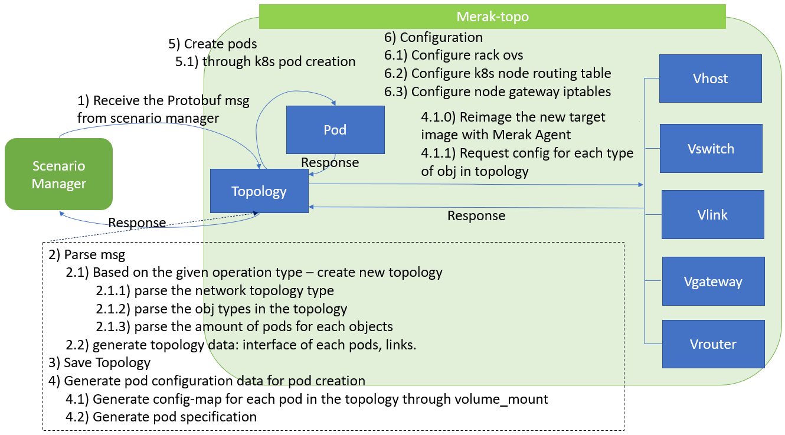
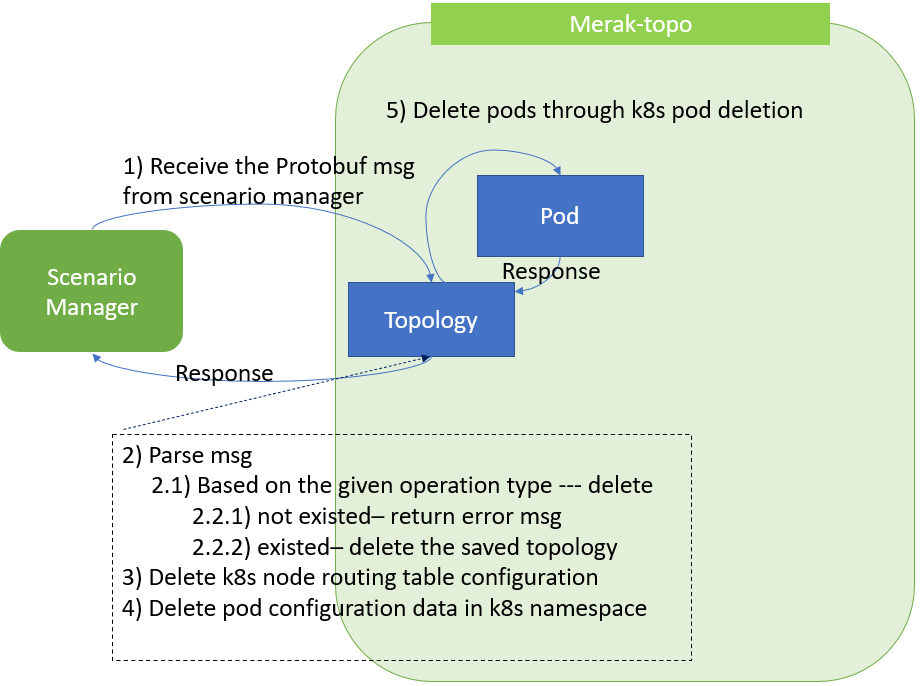

# Overview
This is a page for merak-topo design document.
Merak-topo is a Merak function which create/update/delete network topology in the Kubernete cluster based on the request from the Merak Scenario Manager.

# Service Requriements
<ol>
1. Pull the test target image (ACA+OVS, Mizar)
<ol>
    1.1. Save the targe image <br>
    1.2: Rebuild image by adding golang environment and install Merak Agent <br>
</ol>
2. Run Merak Agent during the pod deploying <br>
3. Create gRPC channel with Scenario Manager <br>
4. Parse the protobuf message from Scenario Manger <br>
5. Create/delete the topology <br>
6. Update the topology <br>
</ol>

# Design
In order to communicate with the Scenario Manager and operate on topology in the Kubernete cluster, the main resource for the Merak-topo is designed as the following workflow, data schema, and class diagram.

## Workflow
This is the main workflows of Merak-topo based on the received message from the Scenario Manager, including the operation for creating, deleting, and updating a topology.
### Create 



### Delete 



### Update 


## Data Schema
The data schemas of common enum type and topology info are adopted from the Protocol Buffer Message definition in the Scenario Manager. The data schema of database in the Merak-topo is defined as follows.

<!-- ### Common enum type


### Topology Info

 -->

### Database 

```JSON
{ 
    "topology-id": ""
    "nodes": 
        {
            "name": "a1"
            "nics": [
                {
                    "intf": "a1-intf1"
                    "ip":"10.99.1.2"
                },
                {
                    "intf": "a1-intf2"
                    "ip":"10.99.1.3"
                }
            ]
            
            
        }
    "links": 
        {
            "pair":[
                {
                    "local_name": "a2"
                    "local_nics": "a2-intf1"
                    "local_ip": ""
                    "peer_name": "a3"
                    "peer_nics": "a3-intf1"
                    "peer_ip": ""
                }
                
            ]
        }

}

```
<!--  -->

## Class Diagram
This is the class diagram of Merak-topo with a gRPC Server and database for communicating with the Service Manager and saving the local topology data.

