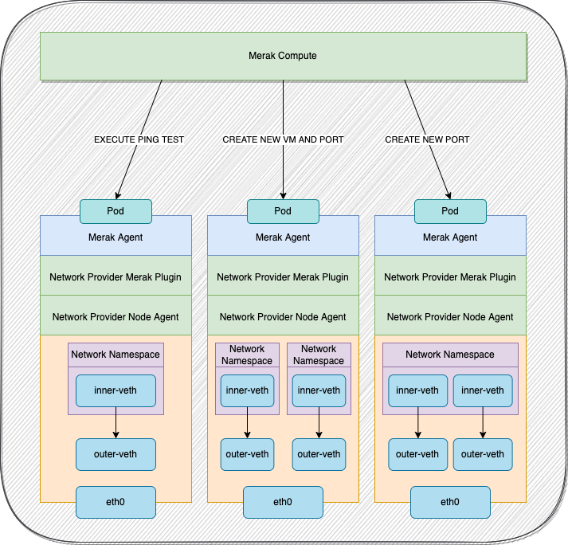
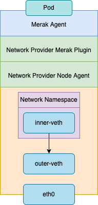
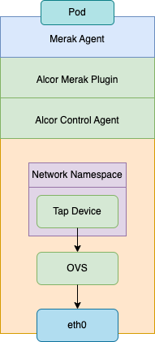
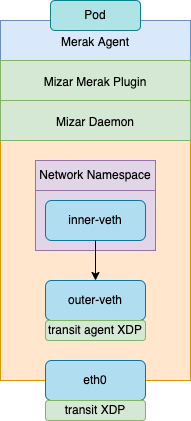

# Merak Agent
Manages VM creation and provides an interface to allocate an endpoint/port on a single node for a specific network provider.

## Services

The following services are exposed by the Merak Agent over gRPC

#### VM

- CREATE
  - Creates a new VM on this host.
- DELETE
  - Delete an existing set of VM on this host.

## Simulation Design

### Merak Node

A node in Merak is represented as a container running on Kubernetes. Each of these containers will run the Merak Agent, alongside the network providers node agent.
The Merak Agent will also provide an interface for developers to produce plugins for additional device creation and configuration specific to the networking provider in test.

In order to simulate network devices and isolation and  on these containers, we do the following.

**VM**: VMs are represented as network namespaces. A single node(container) can have many VMs(network namespaces).

**Port**: Ports are represented as veth-pairs with one end in the network namespace, and the other in the root namspace. A single VM(network namespace) can have many ports.

## Network Provider Plugin
#### Interface

The Merak Agent will communicate locally with the network provider's plugin via gRPC. The following interface will need to be exposed by the plugin.

- INFO:
  - Return information about a port.
- CREATE
  - Do the extra configuration that is required to create a port specific to the network provider.
- UPDATE
  - Do the extra configuration that is required to update a port specific to the network provider.
- DELETE
  - Do the extra configuration that is requried to delete/clean up a port.

#### Workflow

A Merak Node will contain the following once a VM and port have been created.

1. Network Namespace
2. Veth device within the network namespace and its complimentary pair in the root namespace

The Merak agent will then call the Network Provider's plugin to do additional configuration.

For example, in the case of Alcor the following steps will be taken by the plugin.

1. Create a Linux bridge
2. Create a Tap device
3. Attach both the veth device in the root namespace and Tap device to the Linux bridge
4. Attach the Tap Device to OVS.
5. Call Alcor's rest API to create/update port.

#### Alcor

In the case of Mizar the following will need to be done.

1. Create a new Mizar Endpoint CRD object with the required information.

#### Mizar

