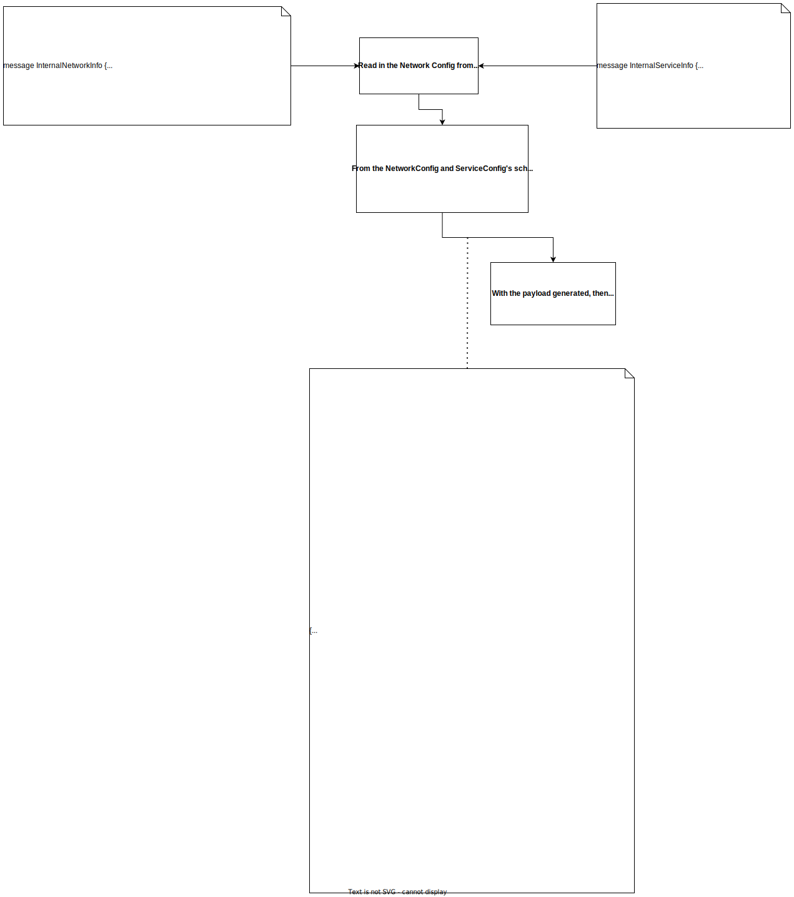

# Merak Network Design Document  

- [Merak Network Design Document](#merak-network-design-document)
  - [Overview](#overview)
  - [Service Requirements](#service-requirements)
  - [Design](#design)
  - [Data Schema](#data-schema)

## Overview  
___  
The Merak Network component is serving the purpose of creating modifying and deleting the Network configuration from the Scenario Manager. In our first version, it will support configuring network configurations with Alcor.  

## Service Requirements  
___  
1. Ability to create/modify/delete network configurations in Alcor  
2. Create Security Groupe  
3. Create/modify/delete Number of VPC 
4. Create/modify/delete Number of Subnet per VPC  
5. Create Router  
6. Connect Subnets to Router  
7. node registration
8. Store the above information in DB, and have the ability to delete them after each test run. Or have ability to modify our network configurations on the fly.  

## Design  
___  

- As for the first version of Merak Network component, it will mainly setup virtual network with [Alcor](https://github.com/futurewei-cloud/alcor).  
- To enable Merak Network have the ability to work with different SDN platform, such as [Alcor](https://github.com/futurewei-cloud/alcor). For now we will have different functions within the code to do different SDN network setup, later may switch to use different micro service do different SDN.  
- Once received request from the Merak Scenario Manager, Merak Network will start to do its job. Making VPC, Security Group, Router, Subnet; and attach them together.  
- After setup the virtual network, all information related to future use will be saved into DB. Currently planning on using the mongoDB, the schema will be show in the below section.  

___  

Merak Network will have couple of functions:  
- For virtual network setup will be very simple function on the Merak Network, it will read in the payload from Merak Config Manager. With the endpoint and payload info pass in,  
- Information come into Merak Network will be:
  - Number of VPC
  - Number of Subnet per VPC
  - VPC cider size
  - Subnet cider size
- For the first design, all subnet within one VPC will be connect to one router.  
- Once the config is received, Merak Network will assign UUID to VPC_id, Router_id, Subnet and other essential information to create the virtual network and have the ability to connect all component together.
- Then Merak Network will make restful api calls to Alcor (and other services later on).  
- As for how to create/modify/delete the virtual network, Merak Network will also receive from the Merak Netconfig; in a list of priory or operation order. For example if want to perform create VPC, Subnets, and attach everything together, may look like the following:
    1. Create VPC
    2. Create Subnet
    3. Attach Subnet to Router
- For node registration, Merak Network will get node info (ip, node name, mac, etc...) from Scenario Manager. Either one-by-one or as bulk. And also the end point and payload. Then Merak Network will make the restful api call.  
  
<!-- - Merak config will be supply the user defined json config file. Then Merak Network will modify the json into proper format then send out the restful request.  
  - While doing the above operation, Merak Network will also keep the state of network configuration within the DB. -->
<!-- ___   -->

<!--    -->

  
## Data Schema  
___  

For new we are planning on store data in Redis DB, below are the schema for each data point:  

- VPC:  
    ```  
    {
        "VPC": {
            "tenant_id_projectId_VPC_ID": "",
            "tenant_id_projectId_Name": "",
            "tenant_id_projectId_Project_id": "",
            "tenant_id_projectId_Tenant_id": "",
            "tenant_id_projectId_cider_size": "",
            "tenant_id_projectId_Tunnel_id": "",
            "tenant_id_projectId_security_group_id":"",
            "tenant_id_projectId_Gateways": ""
        }
    }
    ```  

- Security Group:  
    ```  
    {
        "security_group":{
            "security_group_id":"",
            "Project_id": "",
            "Tenant_id": ""
        }
    }
    ```  

- Router:  
    ```  
    {
        "Router": {
            "Router_ID": "",
            "Name": "",
            "Project_id": "",
            "Tenant_id": "",
            "security_group_id":"",
            "VPC_ID": ""
        }
    }
    ```  

- Subnet:  
    ```  
    {
        "Subnet": {
            "Subnet_ID": "",
            "Name": "",
            "Project_id": "",
            "Tenant_id": "",
            "cider_size": "",
            "VPC_ID": "",
            "security_group_id":"",
            "Router_ID": ""
        }
    }
    ```  

- SDN Path:  
  - This is an example for Alcor, will need further changes and more fields for all other SDN.  
    ```  
    {
        "SDN_path": {
            "Alcor": {
                "create_vpc_endpoint": "",
                "create_router_endpoint": "",
                "create_subnet_endpoint": "",
                "create_sg_endpoint": "",
                "attach_router_endpoint": ""
            }
        }
    }
    ```  
